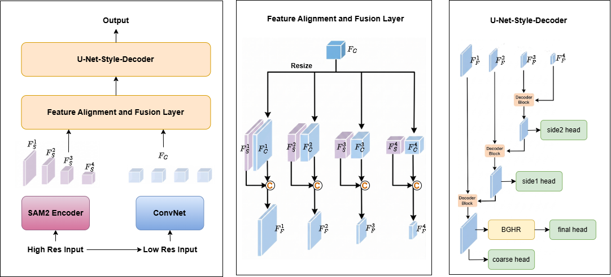
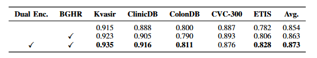
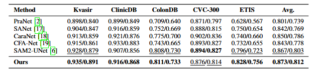

# SAM2-DEB-UNet: Polyp Segmentation with SAM2 and Boundary-Guided Refinement

PyTorch implementation of a dual-encoder polyp segmentation framework built upon a frozen SAM2 Hiera-L backbone and a ConvNeXt-V2 Tiny auxiliary encoder. The proposed architecture incorporates Boundary-Guided High-Resolution (BGHR) refinement to improve boundary localization and segmentation accuracy on challenging polyp datasets.

## Architecture

<p align="center">
  
</p>

---

## Installation

### Clone Repository

```bash
git clone https://github.com/dryi37/Project_DS200
cd SAM2_Polyp
```

### Install Dependencies

```bash
pip install torch torchvision
pip install timm albumentations opencv-python numpy pillow tqdm matplotlib gdown
```

### Install SAM2

```bash
pip install git+https://github.com/facebookresearch/segment-anything-2.git
```

---

## Download SAM2 Checkpoint

Create checkpoint directory:

```bash
mkdir -p checkpoints
```

Download SAM2 Hiera-L checkpoint:

```bash
wget -P checkpoints/ \
https://dl.fbaipublicfiles.com/segment_anything_2/092824/sam2.1_hiera_large.pt
```

Expected structure:

```text
checkpoints/
└── sam2.1_hiera_large.pt
```

---

## Dataset Preparation

The project uses the standard PraNet train/test split.

### Create Data Directory

```bash
mkdir -p data
cd data
```

### Download Training Dataset

```bash
gdown --fuzzy \
"https://drive.google.com/file/d/1YiGHLw4iTvKdvbT6MgwO9zcCv8zJ_Bnb/view?usp=sharing" \
-O TrainDataset.zip
```

Contains:

* Kvasir-SEG
* CVC-ClinicDB

### Download Test Dataset

```bash
gdown --fuzzy \
"https://drive.google.com/file/d/1Y2z7FD5p5y31vkZwQQomXFRB0HutHyao/view?usp=sharing" \
-O TestDataset.zip
```

Contains:

* Kvasir
* CVC-ClinicDB
* CVC-ColonDB
* CVC-300
* ETIS-LaribPolypDB

### Extract

```bash
unzip TrainDataset.zip
unzip TestDataset.zip
```

Optional:

```bash
rm TrainDataset.zip TestDataset.zip
```

Final structure:

```text
data/
├── TrainDataset/
│   ├── images/
│   └── masks/
│
└── TestDataset/
    ├── Kvasir/
    │   ├── images/
    │   └── masks/
    │
    ├── CVC-ClinicDB/
    ├── CVC-ColonDB/
    ├── CVC-300/
    └── ETIS-LaribPolypDB/
```

---

## Training

```bash
python train.py \
  --model sam2unet_conv_bghr \
  --train_dir data/TrainDataset \
  --val_dir data/TestDataset/Kvasir \
  --sam2_ckpt checkpoints/sam2.1_hiera_large.pt \
  --init_from checkpoints/sam2unet_conv/best.pt \
  --epochs 50 \
  --batch_size 12 \
  --lr 1e-4
```

---

## Checkpoints

Checkpoints are automatically saved during training:

```text
checkpoints/
├── sam2.1_hiera_large.pt
├── sam2unet_conv_bghr/
    ├── best.pt
    └── last.pt
```

Where:

* `best.pt` = highest validation Dice score
* `last.pt` = latest training checkpoint

---

## Evaluation

### Evaluate on All Datasets

```bash
python test.py \
  --model sam2unet_bghr \
  --checkpoint checkpoints/sam2unet_conv_bghr/best.pt \
  --test_root data/TestDataset \
  --sam2_ckpt checkpoints/sam2.1_hiera_large.pt
```

### Evaluate Specific Datasets

```bash
python test.py \
  --model sam2unet_conv_bghr \
  --checkpoint checkpoints/sam2unet_conv_bghr/best.pt \
  --test_root data/TestDataset \
  --datasets Kvasir CVC-ClinicDB
```

---

## Results

### Ablation Study

<p align="center">
  
</p>

### Comparison with State-of-the-Art Methods

<p align="center">
  
</p>

Our method achieves the best average performance (0.873 mDice / 0.812 mIoU) and demonstrates consistent improvements across challenging datasets such as ColonDB and ETIS.

## Project Structure

```text
SAM2_Polyp/
│
├── train.py
├── test.py
├── README.md
│
├── models/
│   ├── sam2unet_conv.py
│   ├── sam2unet_conv_bghr.py
│   └── sam2unet_bghr.py
│
├── datasets/
├── checkpoints/
└── data/
```

---

## Acknowledgements

```bibtex
@article{xiong2026sam2,
  title={Sam2-unet: Segment anything 2 makes strong encoder for natural and medical image segmentation},
  author={Xiong, Xinyu and Wu, Zihuang and Tan, Shuangyi and Li, Wenxue and Tang, Feilong and Chen, Ying and Li, Siying and Ma, Jie and Li, Guanbin},
  journal={Visual Intelligence},
  volume={4},
  number={1},
  pages={2},
  year={2026},
  publisher={Springer}
}
```

